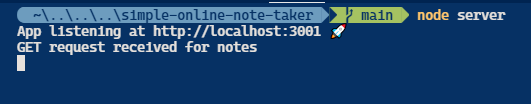
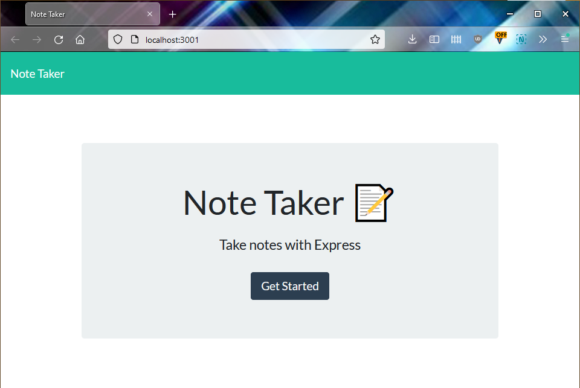
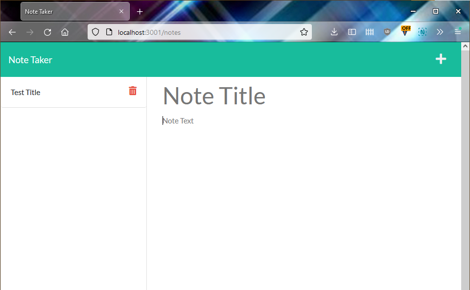
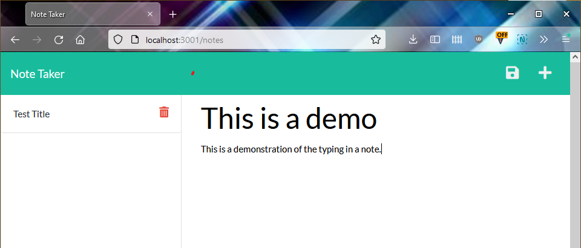

# Simple Online Note Taker [](https://opensource.org/licenses/MIT)

## Description

A simple online note-taking web app

## Contents

- [Installation](#installation)
- [Usage](#usage)
- [Questions](#questions)
- [License](#license)

## Installation

You must have node installed to use this program.

At the command line terminal of your choice type the following:

```
git clone https://github.com/baker-ling/simple-online-note-taker
cd simple-online-note-taker
npm install
```

## Usage

At the directory where you installed this program, type the following on the command-line:

```
node server
```



The program will tell you where it is running on the command-line (most likely http://localhost:3001/). Open that URL and you will be presented with the welcome screen below.



Click on the "Get Started" button to begin checking, entering, and discarding your notes.



- To create a note:
  0. If you have an old note open, click the plus sign in the upper left corner.
  1. Click on where it says "Note Title" and type in a title.
  2. Click on where it says "Note Text" and type in the text of your note.
  3. Click on the "💾" icon next to the plus sign in the upper left to save the note. (This icon appears after you type in some text as the content of your note.)



- To view an old note, click on the note title in the left side-bar.

- To delete an old note, click on the trash can icon next to the note you want to delete in the left side-bar.

### Live Deployment

This app is currently deployed at https://quiet-everglades-55877.herokuapp.com/. If you don't feel comfortable installing the app yourself, go there and take it for a spin. Just remember: your notes aren't private! 

## Questions

If you have any questions, feel free to reach out via one of the following:

- Email: [brian.baker.bdb@gmail.com](mailto:brian.baker.bdb@gmail.com)
- Github: @baker-ling

## License

This application is distributed under the terms of [MIT License](./LICENSE).
